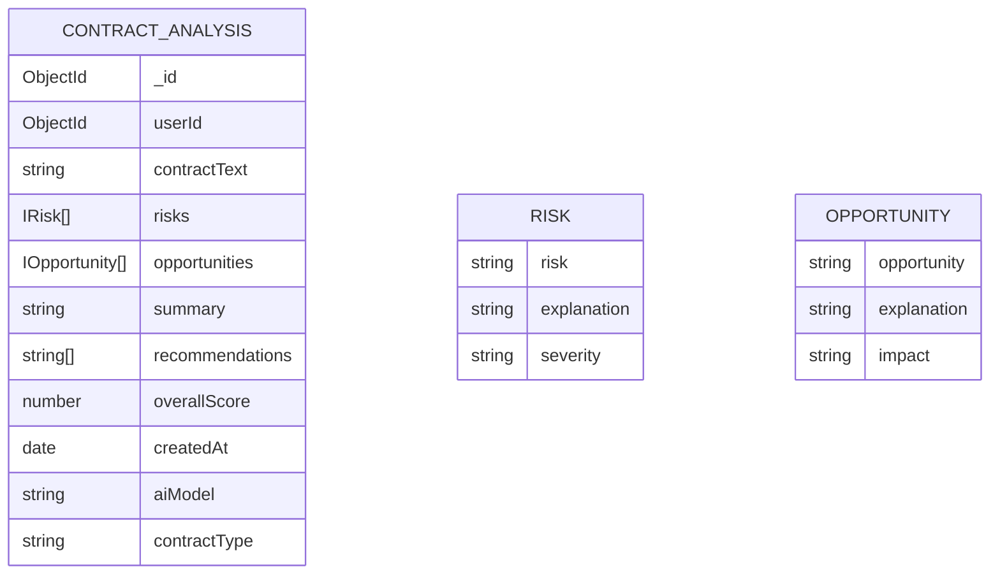
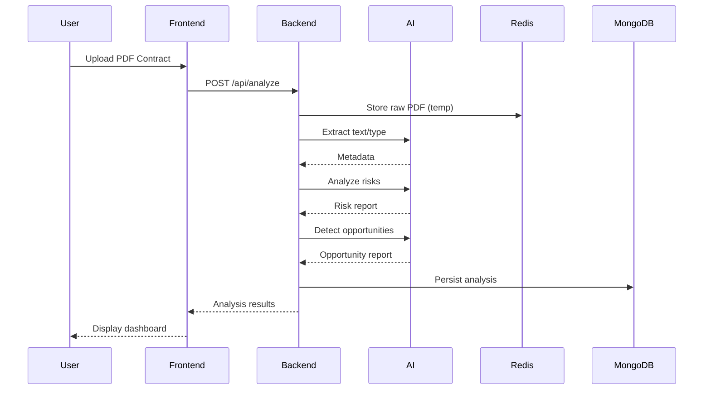

# Covenant AI Platform


A full-stack contract analysis platform leveraging AI for legal document processing, risk assessment, and opportunity identification.

## Key Features
- **AI-Powered Analysis** - Multi-stage processing of PDF contracts
- **Risk Assessment** - Severity-graded risk detection
- **Opportunity Identification** - Impact-rated opportunity discovery
- **User Management** - OAuth authentication with role-based access
- **Payment Integration** - Stripe subscription management
- **Real-time Dashboard** - Interactive results visualization

## Technology Stack

### Frontend
| Component        | Technology           |
|------------------|----------------------|
| Framework        | Next.js 14 (App Router) |
| State Management | React Query + Zustand |
| UI Library       | Shadcn UI            |
| Charts           | Recharts             |
| Tables           | TanStack Table       |

### Backend
| Component        | Technology           |
|------------------|----------------------|
| Runtime          | Node.js 20           |
| Framework        | Express              |
| Database         | MongoDB Atlas        |
| Cache            | Redis                |
| Auth             | Passport.js + JWT    |
| Payments         | Stripe API           |

## Installation

### Prerequisites
- Node.js 20+
- MongoDB 7+
- Redis 7+
- Stripe Account
- Google OAuth Credentials

```bash
# Clone repository
git clone https://github.com/your-org/covenant-ai.git
cd covenant-ai
```

### Client Setup
```bash
cd client
npm install

# Environment variables (create .env)
NEXT_PUBLIC_API_URL=http://localhost:5000
NEXT_PUBLIC_STRIPE_PUBLISHABLE_KEY=your_stripe_key
```

### Server Setup
```bash
cd server
npm install

# Environment variables (create .env)
MONGO_URI=mongodb://localhost:27017/covenantai
REDIS_URL=redis://localhost:6379
STRIPE_SECRET_KEY=your_stripe_secret
GOOGLE_CLIENT_ID=your_google_id
GOOGLE_CLIENT_SECRET=your_google_secret
JWT_SECRET=your_jwt_secret
```

## Database Structure

### Contract Analysis Schema


## AI Processing Workflow



## Running the Application

```bash
# Start both services (from root directory)
concurrently "cd client && npm run dev" "cd server && npm run start"

# Access interfaces
Frontend: http://localhost:3000
Backend: http://localhost:5000
API Docs: http://localhost:5000/api-docs
```

## Configuration Guide

### Required Services
1. **MongoDB** - Document storage
2. **Redis** - PDF text caching
3. **Stripe** - Payment processing
4. **Google OAuth** - User authentication

### Environment Variables
`.env.example` for client:
```ini
NEXT_PUBLIC_API_URL="http://localhost:5000"
NEXT_PUBLIC_STRIPE_PUBLISHABLE_KEY="pk_test_..."
NEXT_PUBLIC_GOOGLE_CLIENT_ID="..."
```

`.env.example` for server:
```ini
MONGO_URI="mongodb://localhost:27017/covenantai"
REDIS_URL="redis://localhost:6379"
STRIPE_SECRET_KEY="sk_test_..."
JWT_SECRET="your_jwt_secret_here"
```

## Development Scripts

```bash
# Client
npm run dev        # Start development server
npm run build      # Create production build
npm run lint       # Run ESLint

# Server 
npm run start      # Start production server
npm run dev        # Start with nodemon
npm run test       # Run integration tests
```

## License
MIT License - See [LICENSE](LICENSE) for details
